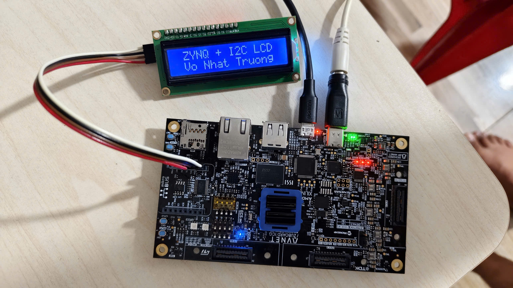
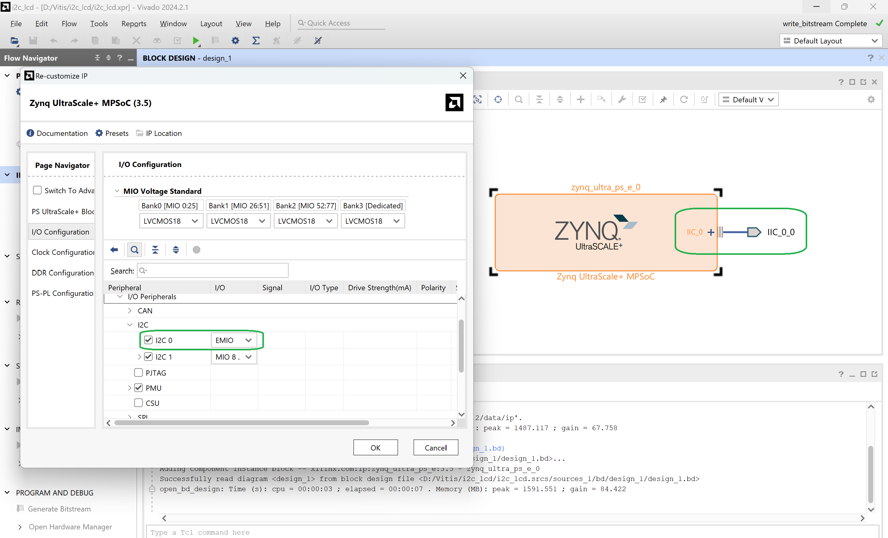
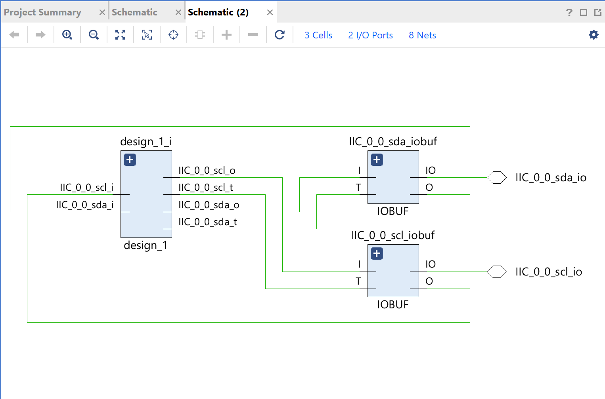

# HLS_LCD_I2C
Triển khai giao tiếp LCD i2c dùng Vitis HLS - Zuboard

## 0. Demo
 
Chuẩn bị Lab (ZuBoard 1CG - Module LCD I2C). Nối dây:
- SDA (MikroE Zuboard) <=> SDA (module LCD I2C).
- SCL (MikroE Zuboard) <=> SCL (module LCD I2C).
- Cấp Nguồn 5V và GND từ Zuboard cho module LCD I2C.
Các chân SDA, SCL trên MikroE Zuboard đã có sẵn pull-up resistors, nên không cần kết nối thêm.



## 1. Block Design on Vivado

- Tạo project trên Vivado, apply Zuboard.
- Create Block Design.
- Add IP **Zynq UltraScale+ MPSoC**.
- Run Block Automation -> Apply Board Preset.
- Double click vào IP **Zynq UltraScale+ MPSoC**, vào cấu hình, disable hết các các ngoại vi **AXI HPM**, **pl_reset** hay **pl_clk**. Enable **I2C 0**, mapping ra **EMIO**.
- Make External port **IIC**.



- Regenerate Layout -> Validate Design -> Create HDL Wrapper -> set as top.
- Generate Block Design, phần Synthesis Options chọn Global -> Generate.
- Open Elaborated Design -> Schematic. Vivado sẽ tự tạo các IOBUF để xử lý phần tín hiệu 2 chiều của các chân SDA, SCL.



- Thêm [file constraint](pins.xdc) có nội dung:

```
set_property PACKAGE_PIN F8 [get_ports {IIC_0_0_scl_io}]
set_property IOSTANDARD LVCMOS33 [get_ports {IIC_0_0_scl_io}]
set_property PACKAGE_PIN F7 [get_ports {IIC_0_0_sda_io}]
set_property IOSTANDARD LVCMOS33 [get_ports {IIC_0_0_sda_io}]
```

- Generate Bitstream -> Export Hardware

## 2. Build app on Vitis

- Launch Vitis IDE.
- Set Workspace.
- Create Platform Component.
- Build Platform.
- Create Empty Embedded Application.
- Add src file [main.c](main.c)
- Build Application.
- Nạp code vào Zuboard.
- Xem thành quả.


  
